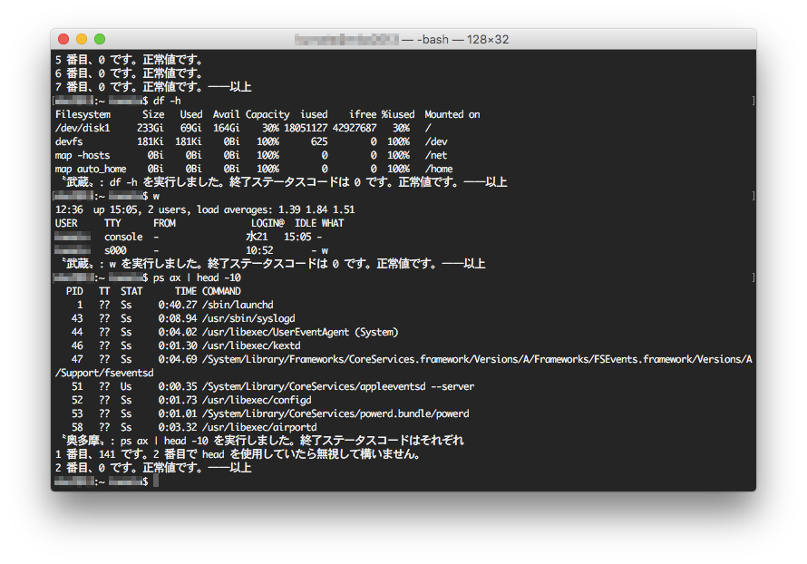

# コマンドを実行するたびに艦長s と鹿角さんが返事してくれている風な bash コード


## 概要



## 利点
例えば以下のコードを実行すると、set -eu していても無言でプロンプトが帰るだけで何がどうなっているのか分かりません。しかし、MusashiPrompt を読み込んでおけば 100% じゃないですがエラーの原因を吐いてくれるので、その後の作業がしやすくなります。

```
#!/bin/bash
set -eu

hoge_return="blahblahblah."
hoge_code=$(echo "$hoge_return" | grep -o 'Code [0-9]*:')

if [ "$hoge_code" != "Code 403:" ]; then
    echo "${hoge_return}"
fi
```


## 使い方
1. Save this code to a file.
2. Edit your .bashrc or .bash_profile. (see below.)
3. Quit editor.
4. Exec "source .bashrc" or "source .bash_profile".


例: .bashrc

```
. $HOME/bin/MusashiPrompt/bashrc.sh
```


## 要件
- UNIX / Unix like
- bash 3.2+


## 変更点
- Linux に対応しました。(Raspbian と Bash on Ubuntu on Windows でも可)
- Mac say と AquesTalkPi に対応。(コメントアウトを外せば使えます)


## 希望
- もっと辛辣な感じにしたい。
- 鹿角さんロジックを組み込みたい。
- AI ライブラリでどうにかできないの？


## ライセンス
Copyright (c) 2016 tkumata

This software is release under the MIT License, please see [MIT](http://opensource.org/licenses/mit-license.php)


## 著者
[tkumata](https://github.com/tkumata)


## 謝辞
[実行したコマンドの終了コードを表示する](http://qiita.com/takayuki206/items/f4d0dbb45e5ee2ee698e)
